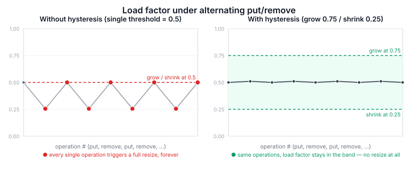

## A quick note before we start

Same disclaimer as [last time](https://soerenlemke.github.io/blog/blog/building-a-generic-hashmap-in-c/): day job is C#, C is a hobby, and a fairly new one. This post picks up right where [Building a Generic Hashmap in C](https://soerenlemke.github.io/blog/blog/building-a-generic-hashmap-in-c/) left off — same project, same "here's what actually happened" approach. I worked through the design and the bugs in dialogue with an AI assistant, which pushed back on me, made me reason through the math and edge cases myself instead of just handing me answers, and ran experiments to check my assumptions rather than let me take them on faith. It's still my own implementation — just one built through a lot of back-and-forth.

The full code lives at [github.com/soerenlemke/kvstore_c](https://github.com/soerenlemke/kvstore_c), if you want to follow along.

## Why

The last post ended with an open TODO sitting right in the code:

```c
// TODO: no resizing yet — load factor grows unbounded, chains get long over time
```

This post is about finally closing that TODO — and about how much more there was to it than "just double the array when it gets full."

## Why resizing matters in the first place

A hashmap only stays fast if its chains stay short. The **load factor** — `count / capacity` — is the usual way to measure how full the table is. The fuller it gets, the more collisions happen, the longer the chains get, and lookups slide from close-to-O(1) toward O(n). Resizing means growing the bucket array *before* that happens, and rehashing every existing entry into the bigger array.

## Growing the map

Nothing too surprising here:

- **Trigger**: load factor goes over `0.75`
- **Growth**: capacity doubles
- **Rehashing**: every node gets moved (not copied — the `malloc`'d key/value bytes stay exactly where they are) into the new bucket array

One decision did come up right away, though: rehashing needs each node's hash to figure out its new bucket index, and my node struct didn't store the hash anywhere — just the key and value. So I had a choice:

1. Recompute the hash for every node, every time you resize
2. Cache the hash in the node when it's first inserted, and just reuse it later

I went with caching — 8 extra bytes per node, forever, in exchange for a cheap resize. Classic space-vs-time trade, and it turned out to be handy later too (more on that further down).

Here's the resize function that came out of that:

```c
static bool hashmap_resize(HashMap* map, const size_t new_capacity) {
    HashMapNode** new_buckets = (HashMapNode**) calloc(new_capacity, sizeof(HashMapNode*));
    if (new_buckets == nullptr) {
        return false;
    }

    for (size_t i = 0; i < map->capacity; i++) {
        HashMapNode* node = map->buckets[i];
        while (node != nullptr) {
            HashMapNode* next = node->next;

            const size_t new_index = node->hash % new_capacity;
            node->next = new_buckets[new_index];
            new_buckets[new_index] = node;

            node = next;
        }
    }

    free(map->buckets);
    map->buckets = new_buckets;
    map->capacity = new_capacity;
    return true;
}
```

## A quick detour: what is this thing, actually?

Before going further, someone reviewed the pre-resizing code and gave me a few pointers I didn't want to just apply blindly:

- Put the struct in the header (make it transparent) instead of hiding it, so it can live on the stack or get embedded in other structs.
- Use `void*` instead of `uint8_t*`.
- Skip the key/value store entirely — build a generic hashset with a comparator function the caller supplies, and let key/value semantics be someone else's problem.

All reasonable advice — but for a different kind of project than mine. That's the design for a general-purpose, reusable C container, the kind of thing that stands in for `std::unordered_map`. I'm not building that. `kvstore_c` is meant to be a byte-oriented key-value store — usable on its own *and* as a library other code can link against (the `CMakeLists.txt` already keeps `hashmap` and `kvstore_c` as separate targets, the same way SQLite ships both `libsqlite3` and the `sqlite3` CLI).

Given that goal:

- **The opaque struct stays.** I'm actively changing the internals right now (the cached hash field, resize logic). Keeping `HashMap*` opaque means none of that leaks out to callers — the same reason `sqlite3*`, `CURL*`, and `git_repository*` all stay opaque in their own libraries. Transparent structs make more sense for tight, performance-critical, intrusive structures inside a single codebase — not for something meant to be linked against from outside.
- **`uint8_t*` + explicit length stays too.** I'm storing byte blobs with known lengths, not arbitrary typed objects, so `memcmp` is already the right tool — no comparator indirection needed.

One thing worth keeping regardless of which way I'd gone: `void*` would've been the wrong call either way, since you can't index into it (`key[i]`) without casting first.

## The harder problem: shrinking

Growing was the easy half. Shrinking is where I ran into a question I honestly hadn't thought about at all going in: what happens if you just mirror the grow logic — same threshold, same factor, opposite direction?

The answer is thrashing. Picture a map sitting right at the shrink threshold, with someone alternating `put`/`remove` on the same key in a loop. If growing and shrinking trigger at the same point, every single operation turns into a full rehash, and O(1) amortized quietly becomes O(n) per call.

The fix is **hysteresis** — a gap between the grow and shrink thresholds, so one insert/remove pair near the boundary can't send the table flip-flopping.

Figuring out how big that gap needs to be took actually running the numbers rather than picking something that "felt safe." Say the map is at `capacity = 2C` and has just dipped below a shrink threshold `T`. That means `count ≈ T · 2C`. Halve the capacity and the load factor right after is:

```
count / new_capacity = (T · 2C) / C = 2T
```

For that to land comfortably under the grow threshold of `0.75`, `2T` needs real room to spare — so `T < 0.375`. I went with `T = 0.25`: right after a shrink, the load factor sits at `0.5`, smack in the middle between empty and the grow line. It also just reads nicely in code — a quarter full shrinks, three quarters full grows.

The difference this makes is a lot easier to *see* than to derive. Both panels below run the same alternating `put`/`remove` pattern on a map sitting right at a boundary:



With one shared threshold, every single operation flips the map's capacity, forever. With the gap in place, the exact same sequence never triggers a resize at all.

```c
#define HASHMAP_GROW_THRESHOLD 0.75
#define HASHMAP_SHRINK_THRESHOLD 0.25
#define HASHMAP_GROWTH_FACTOR 2
#define HASHMAP_SHRINK_FACTOR 2
```

## The crash waiting at capacity zero

Once you're halving capacity repeatedly, an obvious question shows up: does it ever hit zero? I checked what a modulo by zero actually does in C, since every lookup runs `hash % map->capacity`:

```c
size_t capacity = 0;
size_t hash = 12345;
size_t index = hash % capacity;  // crashes
```

That gives a `Floating point exception` (the name is a red herring — it's really the CPU's integer-division-by-zero trap, nothing to do with floats) and a hard crash. No `nullptr` check saves you here — it's undefined behavior the instant `capacity` hits zero.

So `capacity` needs a hard floor of `1` — which lines up with `hashmap_create` already refusing `initial_capacity == 0`. The shrink logic clamps to it:

```c
auto new_capacity = map->capacity / HASHMAP_SHRINK_FACTOR;
if (new_capacity < 1) {
    new_capacity = 1;
}
if (new_capacity != map->capacity) {
    hashmap_resize(map, new_capacity);
}
```

That last check (`new_capacity != map->capacity`) earns its keep too — without it, a map already sitting at `capacity = 1` would call `hashmap_resize` on *every single remove*, running a full pointless `calloc`/rehash/`free` cycle just to land back exactly where it started.

## A surprise: shrinking doesn't fully converge

Once the shrink logic was in, I didn't just assume the math worked out — I traced actual capacity values while inserting and then removing 2000 entries:

```
after filling to 2000 entries: capacity=4096
after emptying completely:     capacity=2      (count is 0)
```

Not `1`, which is worth explaining. The shrink check runs once per `remove` call, and halves at most once. Growth gets away with "one step per call" because `count` only ever climbs by exactly one per `put`, so a single doubling is always enough to recover. Shrinking is subtly different — the *last* remove that empties the map checks and halves once, and then there's simply no further call left to notice the load factor (now `0`) still qualifies for another halving.

The gap does stay small and constant no matter the scale, though — always at most one factor of two, confirmed at both 20 and 2000 entries, and it doesn't compound. So I left it as-is instead of adding a loop to force full convergence — the cost of the gap is a handful of unused bytes in the bucket array, and the cost of "fixing" it is more code (a loop instead of an `if`) for a benefit basically nobody would notice. I did write the trade-off down at the call site, though, so it reads as a decision and not a mystery:

```c
// Shrinking is lazy and single-step per call, mirroring how growth
// is single-step per put. A map that is emptied down to count=0 may
// therefore end up one growth-factor above the true minimum capacity
// (e.g. capacity=2 instead of 1) if no further put/remove happens
// afterwards to trigger another check. This is a deliberate trade-off:
// closing that gap would need a loop here, for a benefit (a few bytes
// of unused bucket array) that isn't worth the extra complexity.
```

## Another quiet decision: what happens if resize fails

`hashmap_resize` can fail — `calloc` might not get the memory it needs for the new bucket array — and it returns `false` when that happens. Both `hashmap_put` and `hashmap_remove` currently just ignore that return value. Worth explaining why that's on purpose and not an oversight: by the time the resize check runs, the put or remove that triggered it has *already succeeded* — the data's safely stored (or gone). A failed resize just means the map stays at its current capacity; nothing crashes, nothing's lost, lookups just stay a touch slower or the array stays a bit bigger than it needs to be. Making `hashmap_put`/`hashmap_remove` return `false` here would actually be misleading, since the thing the caller asked for did work. I left a comment at both call sites so this reads as intentional:

```c
// If calloc fails during resize, the map stays at its old capacity.
// The put itself still succeeded (the value is stored) — we deliberately
// degrade performance only here, instead of making hashmap_put
// incorrectly return false.
```

## Testing it

The existing tests only ever exercised 1–3 entries, which wasn't nearly enough to catch anything resize-related. I added:

- **`test_resize_preserves_all_entries`** — starts at `capacity=4`, inserts 2000 entries (forcing several resizes), then checks every single one is still retrievable with the right value. This is really checking that the cached hash survives rehashing and that no node gets dropped while moving between bucket arrays.
- **`test_resize_then_remove_half`** — inserts 2000, removes every other one, then checks the removed keys are gone and the rest are intact. This exercises resize and removal together, since `hashmap_remove` recomputes the bucket index against the *current* capacity, independently of the cached hash.
- **`test_shrink_to_minimum_capacity`** — fills a map starting at `capacity=1` (grows to `32` after 20 inserts, verified, not guessed), empties it again, and asserts the exact final capacity (`2`, not `1` — see the lazy-shrink trade-off above), plus a `capacity >= 1` check after *every* operation as a standing regression test for the modulo-by-zero crash.

Getting the exact numbers for that last test (`32`, `2`) meant writing a tiny standalone trace program and just running it, instead of trying to hand-calculate 20 rounds of doubling and halving in my head. Good reminder that "pretty sure the math works out" is worth actually checking before it ends up in an assertion.

To make that last test possible at all, I added one small bit of public API, purely for introspection:

```c
size_t hashmap_capacity(const HashMap* map);
```

Note the `const` — it only reads, never mutates, and the compiler holds you to that.

## More review feedback, and which parts actually stuck

A couple more pieces of outside feedback showed up during this work. Not all of it applied equally, so here's the honest breakdown.

**A real bug**: `hash_bytes` was accumulating into a `size_t`, while using FNV-1a's 64-bit constants:

```c
static size_t hash_bytes(const uint8_t* key, const size_t key_len) {
    size_t hash = 1469598103934665603ULL;
    ...
}
```

`size_t` is 64 bits on most platforms I'd realistically target, but it's not *guaranteed* — on a 32-bit platform, the offset basis gets truncated and every multiply wraps at 2³² instead of 2⁶⁴, quietly turning this into some unspecified, un-analyzed hash function instead of FNV-1a. The fix: accumulate in an explicit `uint64_t`, and only narrow to `size_t` right at the final `% capacity`. Completely separately: the constant above is also a digit short of the real FNV-1a 64-bit offset basis (`14695981039346656037` vs. the `1469598103934665603` sitting in the code) — a plain typo, only caught by actually counting digits instead of trusting that a long constant got copied correctly.

Fixing this properly took two tries, not one, and that's worth being honest about rather than smoothing over. My first attempt changed `hash_bytes` to return `uint64_t` and fixed the constant — correct as far as it went, but it only pushed the truncation one line further down. Every call site was still shoving the result straight into a `size_t` local:

```c
const size_t hash = hash_bytes(key, key_len);   // truncates right back down
```

The real fix meant touching every place the hash gets *held*, not just where it's *produced*: the `hash` field on `HashMapNode`, the local in `hashmap_put`, and the inline computations in `hashmap_get`/`hashmap_remove` all needed to become `uint64_t` — but only up to the point where the modulo against `capacity` happens. After that modulo, the result is by definition smaller than `capacity` (a `size_t`), so `size_t` isn't just fine there, it's actually the more honest type — it's not "a hash" anymore, it's a bucket index. Drawing that line deliberately (`uint64_t` before the modulo, `size_t` after) turned out to be the real fix, not just swapping the type everywhere.

That same pass also introduced a second, unrelated bug, only spotted by rereading the diff line by line: `hashmap_put` briefly called `hash_bytes(key, key_len)` twice — once to get `hash`, then again inline while computing `index`, instead of just reusing what it already had:

```c
const uint64_t hash = hash_bytes(key, key_len);
const uint64_t index = hash_bytes(key, key_len) % map->capacity;  // redundant call
```

Same result either way, since the same key always hashes the same — but it silently doubled the cost of every `put`, running the full FNV-1a loop over every key byte twice. It compiled fine and passed every test without a complaint, because nothing about it was actually *wrong*, just wasteful. Good reminder that "the tests still pass" only tells you behavior is fine — it says nothing about efficiency you might've accidentally undone while fixing something else.

**A pedantic-but-correct point**: `unsigned char*` is technically the right type for raw byte access in C — not `uint8_t*`, not `void*`. The standard specifically gives `unsigned char` the right to alias any object's representation. `uint8_t` is `unsigned char` on basically every real platform, but the standard never strictly guarantees it. This will never actually bite me in practice, but it's correct pedantry, and a good reason to reach for it that I genuinely didn't know before.

**Feedback that didn't apply yet**: a suggestion that I'd need an iteration API before I could even resize. True, if you only expose an opaque handle with zero internal access — but `hashmap_resize` lives in the same file as the rest of the hashmap and can already reach straight into `map->buckets`, so it never needed one. It *will* matter the moment I want to iterate from outside — for a future export/dump feature, say — just not for resizing itself.

**A memory-layout point, not directly applicable but worth understanding anyway**: for a generic container holding many same-size elements, a `void*` buffer of contiguous raw bytes (indexed by `element_size`, assigned via `memcpy`) beats a `void**` array of pointers to separately-allocated elements — fewer allocations, better cache locality. My hashmap doesn't map cleanly onto this, since it stores variable-length byte blobs, not fixed-size elements — there's no fixed stride to index by. But the underlying idea still shows up in my code, just in a different shape: every `put` currently does three separate `malloc` calls (node, key copy, value copy), plus a `next` pointer per node for chaining — the same "lots of small allocations plus pointer-chasing" cost, just showing up in chaining instead of array storage. The usual fix for that in hashmap-land is **open addressing** — entries live directly in one contiguous array, no per-entry allocation, collisions get resolved by probing to the next slot — instead of separate chaining. That's a genuinely different structure, not a small patch, so it's earmarked for its own post rather than bolted on here.

## A second review pass

A later round of feedback came in after the hash-type fix above was already in place: *"For the hash function, don't use `size_t`, use `uint64_t`... I also noticed you cache the hash for future resizes. You can take advantage of this to speed up equality checks too... In `hashmap_put()`, you compute the hash twice at the beginning."*

The first and third points were already handled by then (the type change and the double-hashing bug above). Two more were genuinely new.

**Using the cached hash to skip `memcmp`.** Every node already stores its full 64-bit hash for resizing. The idea: inside a bucket's chain, most of the nodes you check *aren't* the key you're after, and comparing hashes first — one integer comparison — can rule most of them out before `memcmp` ever gets involved.

Getting this right took a wrong turn first, and the wrong turn is the part actually worth writing down. My first pass at the updated `keys_equal` looked like this:

```c
if (hash_a == hash_b) {
    return true;   // wrong
}
```

That treats matching hashes as *proof* the keys match — which they aren't. FNV-1a maps an unlimited number of possible keys onto a fixed 2⁶⁴ space of hash values, so by pure pigeonhole logic, two different keys hashing to the same value has to be *possible*, even if wildly unlikely. The relationship only runs one way: different hashes *guarantee* different keys (which is the whole basis for this optimization), but matching hashes only make matching keys *likely* — never certain. My first attempt used the safe direction correctly without really noticing, and then also leaned on the unsafe direction as if it were just as solid. The fix is to flip which side gets the shortcut:

```c
static bool keys_equal(const uint8_t* a, const size_t a_len, const uint8_t* b, const size_t b_len,
                        uint64_t hash_a, uint64_t hash_b) {
    if (hash_a != hash_b) {
        return false;
    }
    if (a_len != b_len) {
        return false;
    }
    return memcmp(a, b, a_len) == 0;
}
```

A hash is a fast way to rule things *out*, never a way to prove things *in*. "Can't be equal" is safe to trust from a hash comparison. "Are equal" never is — that answer always has to come from the actual bytes.

**Avoiding `double` in the load factor check.** The suggested replacement for the floating-point comparison:

```c
map->count >= (map->capacity >> 1) + (map->capacity >> 2)
```

— basically `count >= capacity * 3/4`, done with bit shifts instead of `(double) count / (double) capacity > 0.75`. Good instinct — avoiding floating point on something checked at every insert is reasonable — but tracing the exact trigger points across a range of capacities turned up a real problem with this specific formula:

| capacity | old (`double`, `> 0.75`) triggers at | shift version triggers at |
|---|---|---|
| 4 | count=4 (load 1.000) | count=3 (load 0.750) |
| 7 | count=6 (load 0.857) | count=4 (load 0.571) |
| 16 | count=13 (load 0.812) | count=12 (load 0.750) |

For capacities that are multiples of 4, the shift version just fires one count earlier — it includes the exact `0.75` boundary via `>=`, where the old code excludes it via strict `>`, which is a minor enough difference to be fine either way. But look at `capacity=7`: the shift version fires at load `0.571`, nowhere close to the intended `0.75`. `capacity >> 1` and `capacity >> 2` each round down independently on odd numbers, and those two roundings stack — the less evenly `capacity` divides, the worse it gets. And since `hashmap_create` accepts *any* `initial_capacity`, not just powers of two, and growth only ever doubles from there, a "crooked" starting capacity stays crooked for the map's entire life. That's not a rare edge case — it's the normal case for most starting capacities.

The real fix keeps the original goal (no floating point) without losing precision, using integer cross-multiplication instead of a bit-shift approximation. `count / capacity > 0.75` is exactly the same statement as `4 * count > 3 * capacity` — multiplying both sides of an inequality by the same positive number never changes the answer, and `capacity` is always positive here:

```c
if (4 * (uint64_t) map->count > 3 * (uint64_t) map->capacity) {
```

I checked this exhaustively rather than just spot-checking — against the original `double` version, for every capacity from 1 to 499 and every possible count at each one, with zero mismatches. The `(uint64_t)` casts matter for a reason beyond the earlier hash-truncation issue: `size_t` is only 32 bits on some platforms, and `4 * count` can overflow a 32-bit `size_t` for large-but-realistic map sizes (somewhere around a billion entries) — basically unreachable on 64-bit, but not on 32-bit. Widening explicitly before multiplying keeps the check correct no matter which platform's `size_t` you end up on. The shrink check gets the same treatment: `count / capacity < 0.25` becomes `4 * count < capacity`.

## Where this leaves things

Resizing — growing, shrinking, the hysteresis between them, the capacity-zero crash, the lazy-shrink trade-off — is done and tested. One thing's still explicitly parked for later, and it's sitting right there in the code as a `TODO` rather than just living in my head:

```c
// TODO: consider open addressing instead of separate chaining for cache locality
```

An iteration API (eventually needed for persistence or export) came up as a related idea along the way, but it's not a `TODO` yet — it's not blocking anything right now, so it stays a note here until it's actually next in line. Open addressing feels like its own post, once I get there.

## Conclusion

None of this was exotic once I'd worked through it, but almost none of it was obvious going in either: the thrashing risk of mirroring grow/shrink thresholds, the exact size of gap needed to avoid it, the crash waiting at capacity zero, and the fact that fixing the hash truncation bug introduced two smaller bugs of its own before it actually landed. That last part might be the real lesson of this post — a "fix" isn't done when it compiles and the old tests still pass. It's done once you've traced through what actually changed, line by line, including the lines you didn't mean to touch.

The full project is on GitHub at [github.com/soerenlemke/kvstore_c](https://github.com/soerenlemke/kvstore_c). If you're working through something similar, tracing exact values with a tiny throwaway script — instead of trusting mental arithmetic — caught more real problems in this post than any of the math I did in my head.